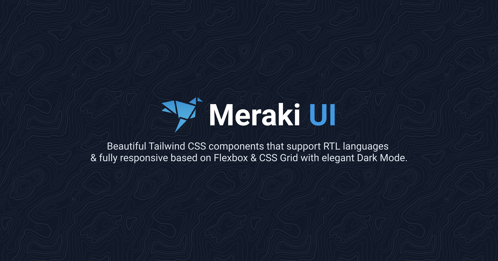

<p align="center">
    

## Meraki UI

🎉 🚀 Beautiful [Tailwindcss](https://tailwindcss.com) components that support RTL languages & fully responsive based on Flexbox & CSS Grid 🏗.
    
[](https://app.netlify.com/sites/merakiui/deploys)

### Resources

-   [Tailwindcss](https://tailwindcss.com)
-   [Unsplash](https://unsplash.com)
-   [Freepik Stories](https://stories.freepik.com)
-   [Heroicons](https://heroicons.dev)
-   [Coolicons](https://coolicons.cool)

### Project setup

```
npm install
```

### Compiles and hot-reloads for development

```
npm run dev
```

### Compiles and minifies for production

```
npm run generate
```

### Credits

-   [Mosab Ibrahim](https://twitter.com/miaababikir)
-   [Khatab Wedaa](https://twitter.com/khatabwedaa)
-   [All Contributors](../../contributors)

### License

The MIT License (MIT). Please see [License File](LICENSE) for more information.
